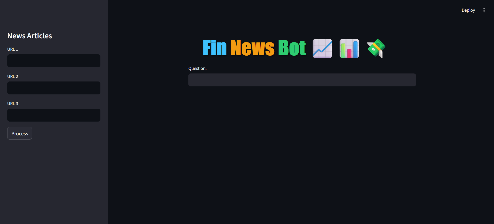

# FinNewsBot 📈📊💸

FinNewsBot is a Streamlit-based application designed to process news articles from URLs, build vector embeddings for their content, and answer user queries with relevant information sourced from those articles. The bot leverages LangChain for its retrieval-based question-answering system, OpenAI embeddings for vector representation, and FAISS for efficient similarity search.



---

## **Features**
- **Interactive UI**: Users can input up to three URLs of news articles.
- **Document Processing**: Splits articles into manageable chunks for better processing.
- **Embeddings Creation**: Generates embeddings using OpenAI's API for semantic understanding.
- **Query Answering**: Uses LangChain's `RetrievalQAWithSourcesChain` to provide answers based on the embedded articles.
- **Source Citation**: Displays the sources used to answer queries.

---

## **Requirements**
### **Python Libraries**
Install the required libraries using the following command:

```bash
pip install streamlit langchain openai faiss-cpu python-dotenv unstructured

```
## Usage/Examples

1. Run the Streamlit app by executing:
```bash
streamlit run main.py

```

2.The web app will open in your browser.

- On the sidebar, you can input URLs directly.

- Initiate the data loading and processing by clicking "Process URLs."

- Observe the system as it performs text splitting, generates embedding vectors, and efficiently indexes them using FAISS.

- The embeddings will be stored and indexed using FAISS, enhancing retrieval speed.

- The FAISS index will be saved in a local file path in pickle format for future use.
- One can now ask a question and get the answer based on those news articles

## Project Structure

- main.py: The main Streamlit application script.
- requirements.txt: A list of required Python packages for the project.
- faiss_store_openai.pkl: A pickle file to store the FAISS index.
- .env: Configuration file for storing your OpenAI API key.